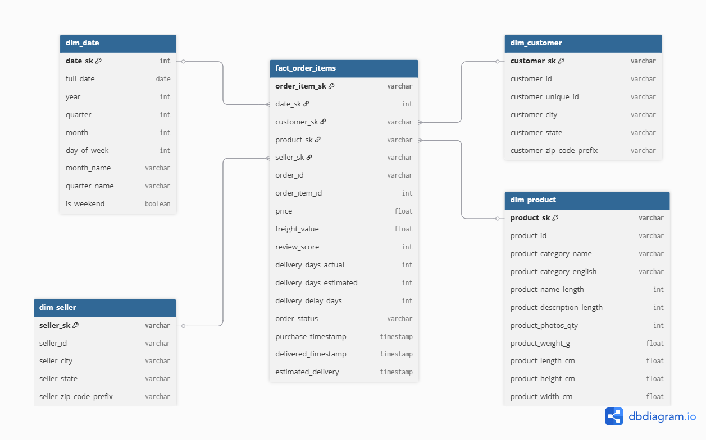

# Olist Data Warehouse & ETL Pipeline

A mini Data Warehouse built from the [Olist Brazilian E-Commerce dataset](https://www.kaggle.com/datasets/olistbr/brazilian-ecommerce) (Kaggle). This project demonstrates end-to-end data engineering: Star Schema design, a Python ETL pipeline, and SQL analytics — transforming 9 raw CSV files (~1.4M rows) into a structured warehouse optimized for analysis.

## Star Schema

The warehouse uses a Star Schema with **1 fact table** and **4 dimension tables**. The grain of the fact table is one order item (one product in one order).



| Table | Rows | Description |
|-------|------|-------------|
| `fact_order_items` | 112,650 | Measures: price, freight, review score, delivery metrics |
| `dim_date` | 774 | Date attributes (year, quarter, month, day_of_week, is_weekend) |
| `dim_customer` | 99,441 | Customer location (city, state, zip) |
| `dim_product` | 32,951 | Product category (PT + EN), dimensions, weight |
| `dim_seller` | 3,095 | Seller location (city, state, zip) |

## Tech Stack

- **Python** (Pandas) — ETL pipeline
- **PostgreSQL** — Data Warehouse
- **SQL** — Analytics queries
- **dbdiagram.io** — Schema design

## Project Structure

```
olist-data-warehouse/
├── data/raw/               # Raw CSV files from Kaggle (gitignored)
├── docs/
│   └── star_schema.png     # ERD exported from dbdiagram.io
├── etl/
│   ├── __init__.py
│   ├── extract.py          # Read 9 CSV files into DataFrames
│   ├── transform.py        # Build star schema (clean, join, calculate metrics)
│   └── load.py             # Write to PostgreSQL (truncate + insert)
├── sql/
│   ├── ddl/
│   │   └── create_tables.sql
│   └── analytics/
│       ├── revenue_analysis.sql
│       ├── delivery_performance.sql
│       └── top_sellers.sql
├── notebooks/
│   ├── dw_analytics.ipynb
├── .env                    # DB credentials (gitignored)
├── .gitignore
├── requirements.txt
├── run_etl.py              # Pipeline entry point
└── README.md
```

## Setup & Usage

### Prerequisites

- Python 3.10+
- PostgreSQL 15+ installed and running
- Olist dataset downloaded from [Kaggle](https://www.kaggle.com/datasets/olistbr/brazilian-ecommerce)

### 1. Clone & install dependencies

```bash
git clone https://github.com/PhamAnhQuoc-HTTT/olist-data-warehouse.git
cd olist-data-warehouse
pip install -r requirements.txt
```

### 2. Prepare data

Download the dataset from Kaggle and place all CSV files in `data/raw/`:

```
data/raw/
├── olist_orders_dataset.csv
├── olist_order_items_dataset.csv
├── olist_order_reviews_dataset.csv
├── olist_order_payments_dataset.csv
├── olist_customers_dataset.csv
├── olist_products_dataset.csv
├── olist_sellers_dataset.csv
├── olist_geolocation_dataset.csv
└── product_category_name_translation.csv
```

### 3. Create database & tables

Create a PostgreSQL database named `olist_dw`, then run the DDL:

```bash
psql -U postgres -c "CREATE DATABASE olist_dw;"
psql -U postgres -d olist_dw -f sql/ddl/create_tables.sql
```

Or execute `sql/ddl/create_tables.sql` in pgAdmin Query Tool.

### 4. Configure environment

Create a `.env` file in the project root:

```env
DB_HOST=localhost
DB_PORT=5432
DB_NAME=olist_dw
DB_USER=postgres
DB_PASSWORD=your_password
```

### 5. Run ETL pipeline

```bash
python run_etl.py
```

Expected output:

```
==================================================
OLIST DATA WAREHOUSE - ETL PIPELINE
==================================================

[1/3] EXTRACT - Reading CSV files...
  [OK] orders: 99,441 rows, 8 columns
  [OK] order_items: 112,650 rows, 7 columns
  ...
  Extracted 9 tables

[2/3] TRANSFORM - Building star schema...
  [OK] dim_date: 774 rows (2016-09-04 → 2018-10-17)
  [OK] dim_customer: 99,441 rows
  [OK] dim_product: 32,951 rows
  [OK] dim_seller: 3,095 rows
  [OK] fact_order_items: 112,650 rows
  Transformed 5 tables

[3/3] LOAD - Writing to PostgreSQL...
  [OK] Connected to PostgreSQL
  [OK] dim_date: 774 rows loaded
  [OK] dim_customer: 99,441 rows loaded
  [OK] dim_product: 32,951 rows loaded
  [OK] dim_seller: 3,095 rows loaded
  [OK] fact_order_items: 112,650 rows loaded
  [OK] All tables loaded successfully

==================================================
ETL COMPLETE in 52.7 seconds
==================================================
```

## Sample Analytics

### Monthly revenue trend

```sql
SELECT d.year, d.month, d.month_name,
       COUNT(DISTINCT f.order_id) AS total_orders,
       SUM(f.price) AS revenue
FROM fact_order_items f
JOIN dim_date d ON f.date_sk = d.date_sk
WHERE f.order_status = 'delivered'
GROUP BY d.year, d.month, d.month_name
ORDER BY d.year, d.month;
```

### Late delivery impact on reviews

```sql
SELECT
    CASE
        WHEN delivery_delay_days <= 0 THEN 'On time / Early'
        WHEN delivery_delay_days <= 5 THEN '1-5 days late'
        ELSE '5+ days late'
    END AS delivery_group,
    COUNT(*) AS order_count,
    ROUND(AVG(review_score)::NUMERIC, 2) AS avg_review
FROM fact_order_items
WHERE order_status = 'delivered'
  AND delivery_days_actual IS NOT NULL
  AND review_score IS NOT NULL
GROUP BY 1
ORDER BY avg_review DESC;
```

See `sql/analytics/` for the full set of queries covering revenue, delivery performance, and seller analysis.

## Key Design Decisions

- **Star Schema over normalized**: Optimized for analytical queries — fewer JOINs, simpler SQL, faster aggregations.
- **Surrogate keys (MD5 hash)**: Decouple warehouse keys from source system IDs.
- **Full refresh ETL**: TRUNCATE + INSERT strategy. Simple and idempotent — suitable for batch processing on static datasets.
- **dim_date generated, not extracted**: Ensures complete date coverage with pre-computed attributes (quarter, is_weekend, etc.).
- **Reviews deduplicated**: One review per order (first by creation date) to avoid inflating fact table rows.

## Data Source

[Olist Brazilian E-Commerce Public Dataset](https://www.kaggle.com/datasets/olistbr/brazilian-ecommerce) — 9 CSV files containing ~100K orders from 2016-2018 on the Olist marketplace in Brazil.
